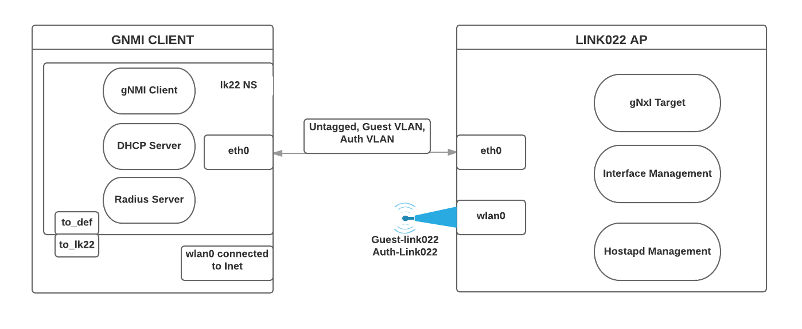

# Link022 Demo
This doc contains the steps to run a demo.

## Setup demo environment
Here is the structure of the demo setup.


The setup has two components, linked directly by an ethernet cable.
  - One Raspberry Pi device as the Link022 AP (gnmi target).
  - The other device (such as Raspberry Pi) as the gateway. It provides reqiured services (dhcp, radius and gnmi client).

### Setup Link022 AP
On the Link022 AP device, run the commands in this [instruction](../agent/README.md) with the sample certificates.

### Setup Gateway
On the device for gateway follow the steps below.
1. Install Golang.
```
wget https://storage.googleapis.com/golang/go1.7.linux-armv6l.tar.gz
sudo tar -C /usr/local -xzf go1.7.linux-armv6l.tar.gz
export PATH=$PATH:/usr/local/go/bin
```
2. Install dependencies.
``` 
sudo apt-get install --no-install-recommends dnsmasq freeradius git
```
3. Download GNMI clients.
```
export GOPATH=$HOME/go
go get github.com/google/gnxi/gnmi_set
go get github.com/google/gnxi/gnmi_get
```
4. Download the [demo folder](./).
5. Enter the demo folder.
```
cd <path to demo folder>
```
6. Setup the gateway.
```
cd util
./server.sh
```
This script creates a network namespace (lk22 by default), which has access to the Link022 AP device.

Note: Reboot the device or run 'cleanup_servers.sh' script to clean up the gateway.

## Demo
*All demo commands are executed inside the lk22 namspace on the gateway device.*
To enter the namespace, run
```
sudo ip netns exec lk22 bash
```

### Push the full configuration to AP
Pushing the entire configuration to AP. It wipes out the existing configuration and applies the incoming one.
Use the [sample configuration](./ap_config.json) here.
```
export PATH=$PATH:/usr/local/go/bin:/home/pi/go/bin
sudo env PATH=$PATH gnmi_set \
-ca=cert/client/ca.crt \
-cert=cert/client/client.crt \
-key=cert/client/client.key \
-target_name=www.example.com \
-target_addr=<link022 AP IP address>:<gnmi port> \
-replace=/:@ap_config.json
```
After configuration pushed, two WIFI SSIDs should appear.
  - Auth-Link022: The authenticated network with Radius (username: host-authed, password: authedpwd).
  - Guest-Link022: The open network. No authentication requried.

### Update AP configuration
Besides replacing the entire configuration, it is also able to update part of the existing configuration.

For example, updating the radio channel.
```
export PATH=$PATH:/usr/local/go/bin:/home/pi/go/bin
sudo env PATH=$PATH gnmi_set -logtostderr \
	-ca=cert/client/ca.crt \
	-cert=cert/client/client.crt \
	-key=cert/client/client.key \
	-target_name=www.example.com \
	-target_addr=<link022 AP IP address>:<gnmi port> \
	-update=/access-points/access-point[hostname=link022-pi-ap]/radios/radio[id=1]/config/channel:6
```

Note: Check [gnxi set client](https://github.com/google/gnxi/tree/master/gnmi_set) for more use cases.
### Fetch AP configuration
Check the existing configuration on AP device with a specific path.
```
export PATH=$PATH:/usr/local/go/bin:/home/pi/go/bin
sudo env PATH=$PATH gnmi_get -logtostderr \
-ca=cert/client/ca.crt \
-cert=cert/client/client.crt \
-key=cert/client/client.key \
-target_name=www.example.com \
-target_addr=link022 AP IP address>:<gnmi port> \
-xpath="/access-points/access-point[hostname=link022-pi-ap]/radios/radio[id=1]/config/channel"
```
The output should be similar to:
```
== getResponse:
notification: <
  timestamp: 1521145574058185274
  update: <
    path: <
      elem: <
        name: "access-points"
      >
      elem: <
        name: "access-point"
        key: <
          key: "hostname"
          value: "link022-pi-ap"
        >
      >
      elem: <
        name: "radios"
      >
      elem: <
        name: "radio"
        key: <
          key: "id"
          value: "1"
        >
      >
      elem: <
        name: "config"
      >
      elem: <
        name: "channel"
      >
    >
    val: <
      uint_val: 8
    >
  >
>
```
Note: Check [gnxi get client](https://github.com/google/gnxi/tree/master/gnmi_get) for more use cases.
