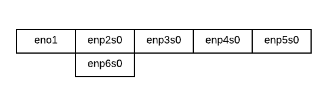
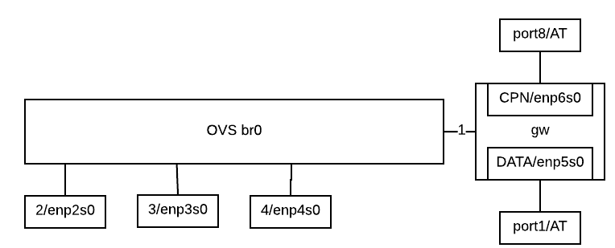

# Link022 Demo With Faucet controlled AT switch
This demo connects Link022 to an Allied Telesis switch (AT-x230-10GP) or an OVS switch controlled by the Faucet Openflow controller.

## Hardware
We use a computer with several network interfaces to run the Faucet controller, OVS and the services
needed by Link022 (DHCP, Radius and NAT'ed routing).

Here is the naming layout of the interfaces.



## OVS port configuration
Here is the layout of the interfaces in the OVS bridge and the services container.


## Software setup
1. Install OVS.
A good guide is [here](https://faucet.readthedocs.io/en/latest/tutorials/first_time.html#connect-your-first-datapath)

1. Install docker and docker-compose.
A good guide is [here](https://docs.docker.com/install/)

1. Create the OVS bridge and link022 services by running [setup.sh](./setup.sh)

1. Install the configuration files.
```
sudo mkdir /etc/faucet
sudo cp faucet.yaml /etc/faucet
sudo cp ../faucet_ovs/guage.yaml /etc/faucet
```
1. Configure the hardware switch using the config at [here](at.conf)

1. Bring up the faucet services.
```
git clone https://github.com/faucetsdn/faucet.git 
cd faucet
sudo docker-compose pull
sudo docker-compose up
```
1. Follow the [directions](https://faucet.readthedocs.io/en/latest/docker.html#docker-compose) to configure prometheus and influxdb, and access the Grafana UI.

## Troubleshoot
* When rebooting the gateway machine, run docker-compose down/up to reset the network containers.

